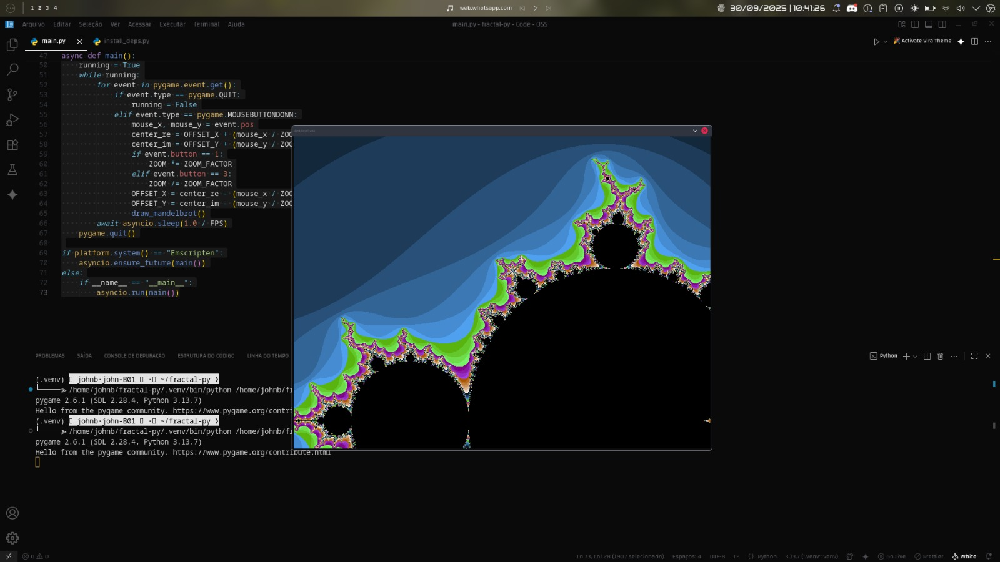

# Fractal Py - Mandelbrot Set Explorer



Um explorador interativo do conjunto de Mandelbrot desenvolvido em Python com Pygame, oferecendo visualização em tempo real com controles intuitivos e logging detalhado.

## Características

- **Visualização em tempo real** do conjunto de Mandelbrot
- **Zoom dinâmico** com foco no cursor do mouse
- **Navegação suave** com controles de teclado e mouse
- **Logging detalhado** no console (FPS, movimento, zoom)
- **Renderização adaptativa** (preview rápido + renderização completa)
- **Controles múltiplos** para máxima usabilidade

## Requisitos

- Python 3.7+
- Pygame
- NumPy

## Instalação

1. Clone o repositório:
```bash
git clone <repository-url>
cd fractal-py
```

2. Instale as dependências:
```bash
pip install pygame numpy
```

Ou use o script de instalação incluído:
```bash
python install_deps.py
```

## Como Usar

Execute o programa:
```bash
python main.py
```

### Controles

#### Mouse
- **Clique esquerdo**: Zoom in no ponto clicado
- **Clique direito**: Zoom out no ponto clicado
- **Scroll da roda**: Zoom in/out centrado no cursor
- **Arrastar**: Mover a visualização

#### Teclado
- **Setas** ou **WASD**: Mover a visualização
- **+** ou **=**: Zoom in no centro
- **-**: Zoom out no centro
- **R**: Resetar para a visualização inicial
- **H**: Mostrar ajuda no console
- **ESC** ou **Fechar janela**: Sair

### Logging no Console

O programa exibe informações detalhadas no console:

- `[render]`: Início e fim das renderizações (preview/complete)
- `[zoom]`: Mudanças de zoom com posição e nível
- `[move]`: Movimentos de pan com deltas e posição final
- `[stats]`: Estatísticas periódicas (FPS, zoom, offset)
- `[state]`: Mudanças de estado (zoom/offset)
- `[help]`: Instruções de controle

Exemplo de saída:
```
[help] Controles: clique-esquerdo para zoom-in, clique-direito para zoom-out, arraste para mover, scroll para zoom, setas/WASD para pan, + e - para zoom, R para reset, H para ajuda.
[render] full start | zoom=150.000 iter=150 offset=(-2.000000,-1.500000)
[render] full done
[stats] fps=15 zoom=150.000 offset=(-2.000000,-1.500000)
[zoom] in @(200,150) -> zoom=225.000
[render] preview start | zoom=225.000 iter=150 offset=(-1.889000,-1.333000)
[render] preview done
```

## Configurações

As configurações podem ser ajustadas no início do arquivo `main.py`:

```python
WIDTH = 800              # Largura da janela
HEIGHT = 600             # Altura da janela
FPS = 15                 # Frames por segundo
RENDER_WIDTH = 400       # Resolução de renderização
RENDER_HEIGHT = 300      # Resolução de renderização
BASE_ITER = 150          # Iterações base
MAX_ITER_CAP = 1000      # Máximo de iterações
ZOOM_FACTOR = 1.5        # Fator de zoom
PAN_STEP = 50.0          # Velocidade de movimento
```

## Algoritmo

O programa implementa o algoritmo clássico do conjunto de Mandelbrot:

1. Para cada pixel na tela, converte coordenadas para o plano complexo
2. Aplica a fórmula iterativa: z = z² + c
3. Conta iterações até |z| > 2 ou atingir o máximo
4. Aplica colorização baseada no número de iterações

## Performance

- **Renderização adaptativa**: Preview rápido durante interação, renderização completa quando parado
- **Iterações dinâmicas**: Aumenta automaticamente com o zoom para manter detalhes
- **Otimizações NumPy**: Cálculos vetorizados para máxima performance

## Estrutura do Projeto

```
fractal-py/
├── main.py              # Programa principal
└── README.md           # Este arquivo
```

## Desenvolvimento

### Adicionando Novos Fractais

Para adicionar outros fractais (Julia, Burning Ship, etc.), modifique a função `mandelbrot()` em `main.py`:

```python
def julia_set(height, width, offset_x, offset_y, zoom, max_iter, c):
    # Implementação do conjunto de Julia
    pass
```

### Personalizando Cores

Modifique a seção de colorização na função `draw_mandelbrot()`:

```python
colors[mask, 0] = (255 * t).astype(np.uint8)      # Vermelho
colors[mask, 1] = (255 * t).astype(np.uint8)      # Verde  
colors[mask, 2] = (255 * (1 - t)).astype(np.uint8) # Azul
```

## Licença

Este projeto é de código aberto. Sinta-se livre para usar, modificar e distribuir.

## Contribuições

Contribuições são bem-vindas! Por favor:

1. Faça um fork do projeto
2. Crie uma branch para sua feature
3. Commit suas mudanças
4. Abra um Pull Request

## Problemas Conhecidos

- Performance pode variar dependendo do hardware
- Zoom muito alto pode causar lentidão devido ao alto número de iterações
- Alguns sistemas podem ter problemas com o modo Emscripten

## Conceitos Matemáticos

### O Conjunto de Mandelbrot

O conjunto de Mandelbrot é um fractal definido no plano complexo. Para cada número complexo c, definimos uma sequência:

```
z₀ = 0
zₙ₊₁ = zₙ² + c
```

O conjunto de Mandelbrot M é o conjunto de todos os números complexos c para os quais a sequência não diverge (ou seja, |zₙ| permanece limitado).

### Critério de Convergência

Um ponto c pertence ao conjunto de Mandelbrot se e somente se:
- A sequência {zₙ} permanece limitada para todo n
- Equivalentemente, se |zₙ| ≤ 2 para todo n

Na prática, usamos o critério: se |zₙ| > 2 para algum n, então c não pertence ao conjunto.

### Algoritmo de Escape

O algoritmo implementado no programa:

1. **Inicialização**: Para cada pixel (x,y), converte para coordenadas complexas:
   ```
   c = x + iy
   ```

2. **Iteração**: Aplica a fórmula iterativa:
   ```
   z = z² + c
   ```
   começando com z = 0

3. **Critério de parada**: Para quando |z| > 2 ou atingir o número máximo de iterações

4. **Colorização**: O número de iterações determina a cor do pixel

### Propriedades Matemáticas

#### Conectividade
- O conjunto de Mandelbrot é **conectado** (não há "ilhas" separadas)
- A fronteira é um fractal com dimensão fractal ≈ 2

#### Simetria
- O conjunto é simétrico em relação ao eixo real
- Se c ∈ M, então c* ∈ M (onde c* é o conjugado complexo)

#### Escala e Auto-similaridade
- A fronteira exibe auto-similaridade em diferentes escalas
- Pequenas cópias do conjunto aparecem em vários níveis de zoom

### Fórmulas de Conversão de Coordenadas

Para mapear pixels da tela para o plano complexo:

```
real = offset_x + (pixel_x / zoom)
imag = offset_y + (pixel_y / zoom)
```

Onde:
- `offset_x, offset_y`: Deslocamento do centro da visualização
- `zoom`: Fator de ampliação
- `pixel_x, pixel_y`: Coordenadas do pixel na tela

### Iterações Dinâmicas

O número de iterações aumenta com o zoom para manter o nível de detalhe:

```
max_iter = min(BASE_ITER + int(50 * log₁₀(zoom/INITIAL_ZOOM)), MAX_ITER_CAP)
```

Isso garante que estruturas finas permaneçam visíveis em altos níveis de zoom.

### Colorização Suave

Para evitar bandas de cor, usamos colorização suave baseada na distância de escape:

```
smooth = iterations + 1 - log₂(log₂(|z|))
```

Onde z é o valor complexo no momento do escape.

## Implementação das Fórmulas no Código

### 1. Fórmula Iterativa Principal

**Teoria**: zₙ₊₁ = zₙ² + c

**Implementação** (linhas 33-36 em `main.py`):
```python
for i in range(max_iter):
    mask = np.abs(z) <= 2
    z[mask] = z[mask] * z[mask] + c[mask]
    output += mask
```

**Como funciona**:
- `z[mask] = z[mask] * z[mask] + c[mask]` aplica z² + c apenas nos pontos que ainda não escaparam
- `mask = np.abs(z) <= 2` identifica pontos que ainda estão dentro do conjunto
- `output += mask` conta as iterações para cada pixel

### 2. Conversão de Coordenadas

**Teoria**: c = x + iy onde x,y são coordenadas no plano complexo

**Implementação** (linhas 27-30 em `main.py`):
```python
x = np.linspace(offset_x, offset_x + width / zoom, width)
y = np.linspace(offset_y, offset_y + height / zoom, height)
X, Y = np.meshgrid(x, y)
c = X + 1j * Y
```

**Como funciona**:
- `np.linspace()` cria arrays de coordenadas reais e imaginárias
- `np.meshgrid()` cria grades 2D para cada pixel
- `c = X + 1j * Y` combina em números complexos

### 3. Critério de Escape

**Teoria**: Se |z| > 2, então o ponto escapa

**Implementação** (linha 34 em `main.py`):
```python
mask = np.abs(z) <= 2
```

**Como funciona**:
- `np.abs(z)` calcula o módulo de cada número complexo
- `<= 2` identifica pontos que ainda não escaparam
- Apenas pontos não-escapeados continuam sendo iterados

### 4. Cálculo de Iterações Dinâmicas

**Teoria**: max_iter = min(BASE_ITER + int(50 * log₁₀(zoom/INITIAL_ZOOM)), MAX_ITER_CAP)

**Implementação** (linha 24 em `main.py`):
```python
def get_max_iter(zoom):
    return min(BASE_ITER + int(50 * max(0, np.log10(zoom / INITIAL_ZOOM))), MAX_ITER_CAP)
```

**Como funciona**:
- `np.log10(zoom / INITIAL_ZOOM)` calcula o logaritmo da razão de zoom
- `50 * max(0, ...)` multiplica por 50, garantindo valor não-negativo
- `min(..., MAX_ITER_CAP)` limita o máximo de iterações

### 5. Colorização Suave

**Teoria**: smooth = iterations + 1 - log₂(log₂(|z|))

**Implementação** (linhas 38-40 em `main.py`):
```python
escaped = output < max_iter
smooth = np.zeros_like(output, dtype=np.float64)
smooth[escaped] = output[escaped] + 1 - np.log(np.log(np.abs(z[escaped])) / np.log(2)) / np.log(2)
```

**Como funciona**:
- `escaped = output < max_iter` identifica pontos que escaparam
- `np.log(np.log(np.abs(z[escaped])) / np.log(2)) / np.log(2)` implementa log₂(log₂(|z|))
- A fórmula completa é aplicada apenas aos pontos que escaparam

### 6. Mapeamento de Cores

**Teoria**: Usar o valor suave para determinar a cor

**Implementação** (linhas 58-63 em `main.py`):
```python
colors = np.zeros((height, width, 3), dtype=np.uint8)
mask = output > 0
t = output[mask] / max_iter
colors[mask, 0] = (255 * t).astype(np.uint8)      # Vermelho
colors[mask, 1] = (255 * t).astype(np.uint8)      # Verde
colors[mask, 2] = (255 * (1 - t)).astype(np.uint8) # Azul
```

**Como funciona**:
- `t = output[mask] / max_iter` normaliza as iterações entre 0 e 1
- `255 * t` mapeia para valores de cor RGB (0-255)
- Cria gradiente do vermelho/verde para azul

### 7. Conversão de Pixels para Coordenadas Complexas

**Teoria**: real = offset_x + (pixel_x / zoom)

**Implementação** (linhas 111-114 em `main.py`):
```python
scaled_x = (mouse_x - 15) * RENDER_WIDTH // (WIDTH - 30)
scaled_y = (mouse_y - 15) * RENDER_HEIGHT // (HEIGHT - 30)
center_re = OFFSET_X + (scaled_x / ZOOM)
center_im = OFFSET_Y + (scaled_y / ZOOM)
```

**Como funciona**:
- `(mouse_x - 15)` remove a margem da tela
- `* RENDER_WIDTH // (WIDTH - 30)` escala para resolução de renderização
- `OFFSET_X + (scaled_x / ZOOM)` converte para coordenada complexa

### 8. Otimizações NumPy

**Teoria**: Operações vetorizadas são mais eficientes

**Implementação** (todo o código usa NumPy):
```python
# Em vez de loops Python:
for i in range(height):
    for j in range(width):
        z[i,j] = z[i,j] * z[i,j] + c[i,j]

# Usamos operações vetorizadas:
z[mask] = z[mask] * z[mask] + c[mask]
```

**Vantagens**:
- Operações em paralelo em todos os pixels
- Código C otimizado por trás
- 10-100x mais rápido que loops Python

### Referências Matemáticas

- **Benoit Mandelbrot** (1924-2010): Matemático que popularizou os fractais
- **Gaston Julia** (1893-1978): Trabalhou com conjuntos relacionados
- **Pierre Fatou** (1878-1929): Contribuiu para a teoria da dinâmica complexa

### Aplicações

- **Teoria do Caos**: Exemplo clássico de sistemas dinâmicos
- **Análise Complexa**: Estudo de funções analíticas
- **Gráficos Computacionais**: Algoritmos de renderização
- **Arte Digital**: Geração de imagens fractais


